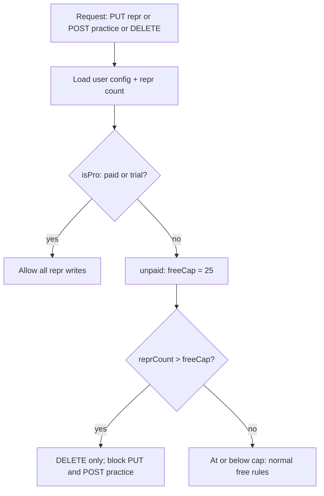

# Stripe subscription + free tier (AWS-hosted)

## Important clarification: “AWS” vs payments

You will keep **accounts and data on AWS** (Cognito, API Gateway HTTP API, Lambda, DynamoDB) as today. **Card charges, auto-renew, and payouts are handled by Stripe**, not by a first-party AWS billing product. That matches your choice (Stripe + AWS).

**$10/year and auto-renew:** Create a **Stripe Product** with a **yearly recurring Price** ($10). Checkout in **subscription** mode creates a subscription that **renews each year by default** until the customer cancels.

**How you get paid:** After onboarding in the Stripe Dashboard, you connect a **bank account**. Stripe **settles** charges (minus fees) to your balance and **payouts** on a schedule (e.g. rolling 2-day) to that bank. You do not “pull money from AWS”; AWS bills you separately for Lambda/DynamoDB.

---

## Account states: trial, unpaid, paid

Expose a single **`accountState`** from the API (and use the same logic server-side for enforcement):

| State | Meaning | Repr access |
|-------|---------|-------------|
| **`trial`** | New account, within the signup trial window | **Full** (same as paid: unlimited reprs, all writes) |
| **`unpaid`** | Trial ended (or never had trial) and no paid entitlement | **Free tier:** 25 repr cap; if count **> 25**, **delete-only** until at or below cap |
| **`paid`** | Active Stripe subscription and/or admin/promo complimentary window | **Full** |

**Trial on account creation:** When [`getUserConfig`](apps/server/src/lib/reprStore.ts) creates the first **`CONFIG`** row for a user (today it writes `pk` + `sk` only), also set:

- `trialEndsAtMs = now + trialDurationMs` where **`trialDurationMs`** defaults to **90 days** (3 months), configurable via env e.g. `DEFAULT_TRIAL_DAYS` on the Lambda (and mirrored constant for client copy if needed).

**Do not** start trial at Cognito sign-up in a separate Lambda unless you prefer that—first API touch that creates CONFIG is enough and matches “account exists in the app.”

**Existing users (migration):** CONFIG rows **without** `trialEndsAtMs` are treated as **no active trial** → `unpaid` unless `paid`. Do **not** retroactively grant trial to everyone (avoids surprise unlimited access). Optional one-off script to give trial only to accounts created after a cutoff if you want.

**Fields on `UserConfigItem`** ([`libs/shared/quota`](libs/shared/quota/src/index.ts) or new `libs/shared/subscription`):

- `trialEndsAtMs?: number` — set once at CONFIG creation; **never shortened** by Stripe webhooks (same immutability spirit as complimentary grants).
- `stripeCustomerId?`, `stripeSubscriptionId?`, `stripeSubscriptionStatus?`, `stripeCurrentPeriodEndMs?`
- `complimentaryAccessUntilMs?` — admin/promo grants only

**Resolution helpers** (shared lib, unit-tested):

```text
stripeProActive     = Stripe status in { active, ... }  // decide past_due explicitly
complimentaryActive = complimentaryAccessUntilMs && now < that
trialActive         = trialEndsAtMs && now < trialEndsAtMs

isPaidEntitlement   = stripeProActive || complimentaryActive
isPro (writes)      = isPaidEntitlement || trialActive   // full app access

accountState:
  if isPaidEntitlement → 'paid'
  else if trialActive → 'trial'
  else → 'unpaid'
```

**Note:** Stripe’s own subscription status `trialing` is unrelated to your **app trial**—name carefully in code (`trialActive` vs `stripeTrialing`) to avoid confusion.

**Why not only `isPaid`:** Paid access can lapse while complimentary or trial windows still apply; Stripe webhooks must not clear `trialEndsAtMs` or `complimentaryAccessUntilMs`.

**Webhook merge rules:**

- Stripe paid on/off: update Stripe fields only; never touch `trialEndsAtMs` or shorten complimentary without an admin action.
- **`isPro` / write-lock / create-cap** use `isPro` above, not `maxReprsAllowed === null` alone.

**`GET /user/config` response (illustrative):**

- `accountState`: `'trial' | 'unpaid' | 'paid'`
- `isPro`: boolean (for quick UI gates)
- `trialEndsAtMs`, `complimentaryAccessUntilMs`, `stripeCurrentPeriodEndMs` (as applicable)
- `proSources`: `{ stripe?, complimentary?, trial? }` (booleans for support/debug)

---

## Write-access rules (“delete-only” when over free cap)

Today, [`putReprHandler`](apps/server/src/handlers/reprs.ts) only blocks **creating** a new repr when `count >= maxReprsAllowed`. [`markReprPracticedHandler`](apps/server/src/handlers/reprs.ts) is always allowed. That does **not** match your new policy for lapsed users who still have **> 25** reprs.

Introduce a small shared helper (e.g. `libs/shared/subscription`) used by the repr handlers. **Gate on `isPro`** (`paid` entitlement **or** `trial`), not on `maxReprsAllowed === null` alone.



- **DELETE:** always allowed.
- **PUT / POST practice:** if **unpaid** and `reprCount > 25` → **403** `REPR_WRITE_LOCKED`; if unpaid and `count >= 25` on **create**, existing create-cap applies.
- **Trial and paid:** no write-lock from repr count.

**GET /reprs** always allowed.

**During trial:** users are **not** subject to the 25 cap—trial is “full product,” not “25 reprs free.” After trial → **unpaid** rules unless they subscribe or redeem a grant/code.

---

## Stripe integration shape (Lambda + API Gateway)

**New authenticated routes** (same Cognito authorizer as existing routes in [`apps/server/src/cdk/repr-server-stack.ts`](apps/server/src/cdk/repr-server-stack.ts)):

1. **`POST /billing/checkout-session`** — reads `sub` from existing [`getUserId`](apps/server/src/lib/auth) (or equivalent), creates a Stripe **Checkout Session** (`mode: 'subscription'`, yearly Price id), sets `client_reference_id` or `metadata.cognitoSub` to user id, returns `{ url }` for redirect.
2. **`POST /billing/portal-session`** (optional but recommended) — Stripe **Customer Portal** so users can **cancel**, update card, see invoices; cancel at period end is the usual pattern.

**New public route (no Cognito authorizer):**

3. **`POST /billing/stripe-webhook`** — verify `Stripe-Signature` with webhook signing secret; handle at minimum:
   - `checkout.session.completed` (link Stripe customer to user if first purchase)
   - `customer.subscription.updated`
   - `customer.subscription.deleted`
   - (optionally) `invoice.payment_failed` for `past_due` / dunning messaging later

Update Dynamo **`CONFIG`** row in the webhook handler (reuse [`keyForUserConfig`](apps/server/src/lib/userConfig.ts) / [`PutCommand`](apps/server/src/lib/reprStore.ts) patterns; consider a dedicated `updateUserBillingConfig` in `reprStore` to avoid scattering Dynamo writes).

**CDK / security:**

- Add routes in [`repr-server-stack.ts`](apps/server/src/cdk/repr-server-stack.ts): webhook route **without** `authorizer`.
- Store **`STRIPE_SECRET_KEY`** and **`STRIPE_WEBHOOK_SECRET`** in **Secrets Manager** (or SSM Parameter Store) and grant `reprHandler` `secretsmanager:GetSecretValue` (or inject at deploy time from context for dev only—document tradeoff).
- Add env vars for **Stripe Price ID** (yearly $10) per stage (dev test mode vs prod live keys).

**Webhook body caveat:** Stripe signature verification requires the **raw request body string**. Ensure the Lambda integration passes the body in a way your router can forward unchanged (API Gateway HTTP API v2 + `event.body` is usually fine; avoid JSON-parsing before verify).

---

## Admin: grant subscription by email (1 year or arbitrary duration)

**Goal:** You enter an **email** (the one the user signed up with in Cognito) and a **duration** (e.g. 365 days); the user immediately gets **pro** (`isPro` true) until that grant expires, **stacking** sensibly with Stripe if both exist.

**Resolve user id:** Cognito [`AdminGetUser`](https://docs.aws.amazon.com/cognito-user-identity-pools/latest/APIReference/API_AdminGetUser.html) with `Username` = email works when the pool uses **email as username** (your pool uses `signInAliases: { email: true }` in [`repr-server-stack.ts`](apps/server/src/cdk/repr-server-stack.ts), which is the common setup). If a pool ever used opaque usernames, fall back to [`ListUsers`](https://docs.aws.amazon.com/cognito-user-identity-pools/latest/APIReference/API_ListUsers.html) with the `email` attribute filter. Read `sub` from the user’s attributes — that value must match [`getUserId`](apps/server/src/lib/auth) / Dynamo `USER#${sub}`.

**Write to Dynamo:** On the user’s **`CONFIG`** row, set:

- `complimentaryAccessUntilMs = max(existing ?? 0, now + durationMs)` **or** `now + durationMs` only if you prefer **no stacking** (document the product choice; **max** is friendlier for “gift a year on top of what they have”).
- Do **not** require a Stripe customer for this path.

**Two implementation options (you can ship both):**

1. **Repo script (recommended MVP):** e.g. `scripts/grant-complimentary-access.mjs` run locally with your AWS credentials (`AWS_PROFILE`), args `--email`, `--days`. Uses Cognito admin API + DynamoDB `UpdateItem` on the CONFIG key. **Smallest attack surface** — no new public HTTP surface.
2. **Secured HTTP admin route:** e.g. `POST /admin/grant` on API Gateway **without** Cognito user auth, protected by a **static admin key** in `Authorization` compared to a value in **Secrets Manager**, plus optional IP allowlist or separate “admin” Lambda not exposed on the public web. Useful if you want to grant from a phone without a laptop.

**IAM:** Whichever path you choose, the principal needs `cognito-idp:AdminGetUser` (and possibly `ListUsers`) on the user pool ARN, and DynamoDB update rights on the reprs table — today only [`reprHandler`](apps/server/src/cdk/repr-server-stack.ts) has table access; either extend that Lambda’s IAM for admin-only code paths (guarded by secret) or add a tiny **separate** admin Lambda invoked only by you / CI.

**GET /user/config:** Return `accountState`, `isPro`, `trialEndsAtMs`, `proSources`, and complimentary/Stripe timestamps (see Account states section).

---

## Promo codes: unique, single-use discount and free codes

**Goal:** You can generate **unique** codes (e.g. opaque random strings) that are **one-time use** and optionally **restricted to a specific user** (by Cognito `sub` or email). Two common kinds:

- **Discount:** User still checks out on Stripe at a reduced price. Use Stripe **Coupon** + **Promotion Code** with `max_redemptions: 1`; attach to the Checkout Session via `discounts`.
- **Free access:** No subscription charge for the covered period. Either a Stripe **100% off** coupon (still creates a $0 subscription—webhooks look like paid) **or** extend **`complimentaryAccessUntilMs`** only (no Stripe subscription—simpler, reuses the existing complimentary entitlement path).

**Why not only Stripe Promotion Codes:** Stripe enforces global redemption limits and can restrict to a **Stripe Customer**, but “this code is only for `alice@example.com`” before Alice exists as a Stripe customer is awkward. A thin **Dynamo ledger** gives you full control.

**Dynamo shape (same table as reprs, new key pattern):**

- `pk: PROMO#<normalizedCode>` (or `pk: PROMO`, `sk: CODE#<hash>` if you prefer a GSI—pick one pattern and document it)
- Attributes (illustrative): `type` (`checkout_discount` | `complimentary_days`), `stripePromotionCodeId?` (Stripe `promo_...` id for discount path), `complimentaryDays?` (for pure-comp path), `expiresAtMs?`, `reservedForSub?` / `reservedForEmail?` (optional bind to one user), `redeemedBySub?`, `redeemedAtMs?` (set once), `createdAtMs`

**Single-use enforcement:**

- **At redemption:** `UpdateItem` with `ConditionExpression` such as `attribute_not_exists(redeemedBySub)` (and not expired, and optional `reservedFor*` matches the caller).
- **Backstop for Stripe-backed codes:** keep Stripe `max_redemptions: 1` on the Promotion Code so even if two Checkout sessions race, Stripe rejects the second.

**Flows:**

1. **Mint (admin only):** script or secured admin API: generate secret code string → create Stripe Coupon/Promotion Code (discount %) or amount → write Dynamo `PROMO#...` row with metadata you need.
2. **Checkout with discount:** extend **`POST /billing/checkout-session`** to accept optional `promoCode` in JSON body. Server loads the `PROMO` row, validates unused + not expired + reserved user (if any) matches JWT `sub` / email claim, then creates Checkout Session with `discounts: [{ promotion_code: stripePromotionCodeId }]`. Optionally pass `metadata` / `client_reference_id` so the **webhook** (`checkout.session.completed`) can **mark the Dynamo row redeemed** (`redeemedBySub`, `redeemedAtMs`) idempotently (same `session.id` or `subscription` id).
3. **Free access without Stripe (complimentary-only code):** authenticated **`POST /billing/redeem-promo`** (or fold into checkout-session with `mode` flag): validate `PROMO` row type `complimentary_days`, then apply the same **`complimentaryAccessUntilMs` max-stack** rule as admin email grants, mark promo redeemed in the same transactional write pattern as user CONFIG update (consider **TransactWrite** updating both `PROMO#` and `USER#...` CONFIG).

**Client:** Subscribe / Upgrade UI includes optional **“Have a code?”** field; sends code to checkout-session or redeem endpoint depending on type.

**Operational:** Rate-limit redeem + checkout endpoints; do not log full codes in CloudWatch in plain text (or redact); treat codes like secrets when minting.

---

## Client changes

### Account status banner (trial / unpaid)

**Placement:** Full-width banner at the **top of the main content area**, directly **below** the sticky [`Header`](libs/components/src/Header/Header.tsx) and **above** routed page content. Implement as a shared component (e.g. `AccountStatusBanner` in `libs/components`) mounted once in [`apps/client-web/src/App.tsx`](apps/client-web/src/App.tsx) inside `app-content-container`, before `app-content-routes`—so it appears on Home, Reports, Settings, ViewRepr, etc., without duplicating per page.

**When to show:**

- **`accountState === 'trial'`** and signed in + billing config loaded → show trial banner.
- **`accountState === 'unpaid'`** and signed in + loaded → show unpaid banner.
- **`accountState === 'paid'`** → **no** banner.
- Hide on auth-only routes (`/signin`, `/signup`, `/forgot-password`, `/change-password`) and when signed out.

**Copy (l10n keys; English defaults):**

| State | Message |
|-------|---------|
| **Trial** | `This is a trial account and has full functionality for {{count}} more day(s).` — use proper pluralization: **1 day** vs **N days** (not literal “day(s)” in UI). |
| **Unpaid** | `This is an unpaid account and is limited to 25 reprs.` |

**Trial day count:** Compute from `trialEndsAtMs` returned by `GET /user/config`: remaining **whole calendar days** until end (document formula in helper, e.g. `Math.max(0, Math.ceil((trialEndsAtMs - now) / 86400000))` or end-of-day semantics—pick one and test edge cases at midnight UTC vs local). Server already sends `trialEndsAtMs`; client derives `count` for the string.

**Optional second line (unpaid only, when `reprCount > 25`):** Short addendum below the main unpaid line, e.g. “Delete reprs until you are at or below 25, or subscribe.”—only if you want it in MVP; primary unpaid banner is the fixed 25-repr sentence above.

**Styling:** Distinct but non-blocking (e.g. Bootstrap `Alert` `info` for trial, `warning` for unpaid); banner stays visible while scrolling main content (does not need to be sticky unless you prefer it).

**Separate from write-lock:** The account banner is **always** shown for trial/unpaid. Additional toast/banner on `REPR_WRITE_LOCKED` when unpaid user tries practice/save while over 25 reprs remains a separate UX (see below).

### Other client work

- Extend [`ReprsApiModule.getUserConfig`](apps/client-web/src/modules/ReprsApi/ReprsApi.module.ts) / [`libs/reprs-api`](libs/reprs-api/src/ReprsApi.module.ts) with **`accountState`**, `isPro`, `trialEndsAtMs`, Stripe/complimentary fields.
- Redux **billing** slice (or extend quota): store `accountState` and `trialEndsAtMs` for banner + header.
- [`Header`](libs/components/src/Header/Header.tsx): **Upgrade** when `accountState === 'unpaid'`, and optionally when `accountState === 'trial'` (button label can differ from banner text).
- Subscribe page: promo code field; explain $10/year after trial.
- UX when locked (`REPR_WRITE_LOCKED`): toast (and optional inline hint) for **unpaid** users over 25 reprs attempting practice/save—not a substitute for the standing unpaid banner.
- Localization: e.g. `billing.banner.trial`, `billing.banner.trial_one`, `billing.banner.trial_other`, `billing.banner.unpaid` in [`libs/localization/src/en.json`](libs/localization/src/en.json) (mirror client-web copy if required by build).

---

## Operational / legal (non-code but required)

- Stripe **Customer Portal** + Terms/Privacy updates for paid users.
- **Test mode** keys for Dev stack; **live** keys only on Prod deploy workflow secrets (align with [`deploy-prod.yml`](.github/workflows/deploy-prod.yml) pattern).

---

## Testing strategy

- Unit tests for **write-lock** (trial = full access; unpaid under/over 25; paid/complimentary = full).
- Unit tests for **`resolveAccountState` / `isPro`**: trial only → `trial`; trial expired → `unpaid`; Stripe active → `paid` even if trial still running; complimentary extends `paid`; webhook does not clear `trialEndsAtMs`.
- Test **CONFIG creation** sets `trialEndsAtMs` ≈ now + 90d; missing `trialEndsAtMs` on old rows → `unpaid` not `trial`.
- Server handler tests mocking Stripe webhook payloads (construct minimal signed events or test the “handler after verify” module with dependency injection).
- Local dev: **Stripe CLI** `listen --forward-to` your dev API webhook URL.
- Promo: unit tests for validation matrix (unused vs redeemed, expired, wrong user when `reservedFor*`, Stripe attach on checkout); integration test idempotent webhook marking `PROMO#` redeemed once.
